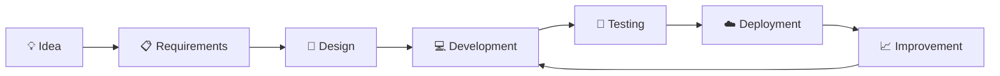
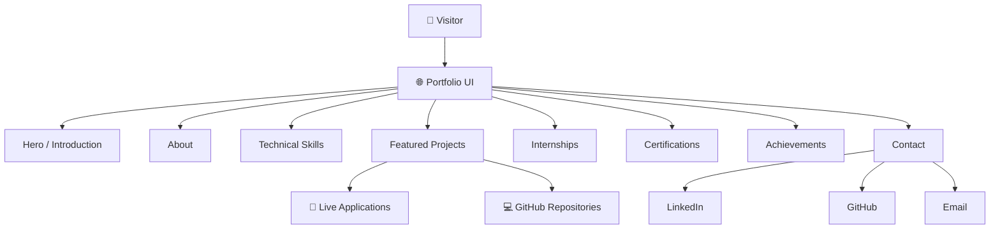

# 👋 Hi, I'm Naveen Babu

<p align="center">
  <strong>Software Developer • Computer Science Engineering Student • Full-Stack Developer</strong>
</p>

<p align="center">
  <a href="https://naveen-portfolio-swart-rho.vercel.app/">🌐 Portfolio</a> •
  <a href="https://github.com/Naveenbabu45">💻 GitHub</a> •
  <a href="https://www.linkedin.com/in/kommmavarapunaveenbabu/">💼 LinkedIn</a>
</p>

<p align="center">
  Building practical software, strengthening problem-solving skills, and continuously improving through real-world projects.
</p>

---

## 🌐 Live Portfolio

🚀 **[Visit My Portfolio](https://naveen-portfolio-swart-rho.vercel.app/)**

This repository contains the source code and documentation for my personal developer portfolio.

The portfolio is designed to present my:

- Software development projects
- Full-stack applications
- AI/ML work
- Internship experience
- Certifications
- Academic background
- Achievements
- Technical skills
- Contact and professional links

---

# 👨‍💻 About Me

I am a **B.Tech Computer Science Engineering student** with a strong interest in software development, full-stack engineering, problem solving, and building practical applications.

I enjoy taking an idea from concept to implementation and working across different parts of a software system — from frontend interfaces and backend APIs to databases, authentication, deployment, and application architecture.

My current focus is on strengthening my **Java, Data Structures & Algorithms, full-stack development, backend engineering, and software engineering fundamentals**.

### Current Focus

- ☕ Java
- 🧩 Data Structures & Algorithms
- 🧠 Problem Solving
- 🌐 Full-Stack Development
- ⚙️ Backend Development
- 🗄️ Databases
- 🔐 Authentication & APIs
- 🤖 AI/ML Applications
- ☁️ Cloud & Deployment
- 🚀 Building real-world projects

---

# 🎓 Education

**Bachelor of Technology — Computer Science and Engineering**

**Kallam Haranadhareddy Institute of Technology**

- 📅 Aug 2023 – May 2027
- 📊 Grade / CGPA: **8.5**

---

# 🛠️ Technical Skills

## 💻 Programming Languages

- Java
- Python
- C
- C++
- JavaScript

## 🌐 Frontend Development

- HTML5
- CSS3
- JavaScript
- React.js
- Vite
- Tailwind CSS
- React Router
- Axios
- Chart.js
- Lucide React

## ⚙️ Backend Development

- Node.js
- Express.js
- REST APIs
- FastAPI

## 🗄️ Databases

- MongoDB
- MongoDB Atlas
- MySQL
- SQL

## 🔐 Authentication & Security

- JWT Authentication
- bcrypt / bcryptjs
- Protected Routes
- Role-Based Access Control
- Server-Side Validation
- Environment-Based Configuration

## 🧠 Computer Science Concepts

- Data Structures & Algorithms
- Object-Oriented Programming
- Database Management Systems
- Problem Solving
- REST API Architecture
- Full-Stack Application Architecture

## 🔧 Tools

- Git
- GitHub
- VS Code
- Jupyter Notebook
- npm

## ☁️ Deployment & Platforms

- Vercel
- Render
- MongoDB Atlas

---

# 🚀 Featured Projects

## 🤖 RecoverX — Autonomous Payment Recovery Agent

An intelligent payment recovery system that evaluates failed transactions, estimates recovery outcomes, applies economic guardrails, and selects the best eligible recovery action.

### Core Capabilities

- 🧠 RandomForest probability model
- 💰 Expected Value optimization
- 🔄 Multiple recovery actions
- 🛡️ Economic and eligibility guardrails
- ⛔ Retry stopping rule
- 👤 Human escalation logic
- 💳 Payment-method switching logic
- 🧾 Explainable decision output
- 📋 Audit trail
- ⚡ FastAPI backend
- 📊 Interactive dashboard
- 🧪 Reproducible simulation

### Candidate Actions

```text
retry_now
retry_later
switch_method
escalate_human
do_nothing
```

### Simulation Result

**₹54.7L recovered • 65.8% recovery rate • +57.9% more value recovered**

> The reported figures are from a documented synthetic simulation and are not a production financial-performance claim.

### Links

- 🚀 **[Live Demo](https://recoverx-dashboard.onrender.com/)**
- 💻 **[Source Code](https://github.com/Naveenbabu45/recoverx)**

---

## 📈 SB Stocks — Full-Stack Paper Trading Platform

A full-stack paper-trading platform that simulates stock investing using virtual capital.

The application combines a React dashboard with an Express/MongoDB backend, market-data integration, portfolio accounting, watchlists, order history, authentication, and protected administration.

### Core Capabilities

- 🔐 JWT authentication
- 👤 User accounts
- 📊 Trading dashboard
- 🔎 Stock search
- 📈 Stock details
- 📉 Historical price charts
- 💰 Virtual buy/sell trading
- 💼 Portfolio management
- 📊 Realized and unrealized P&L
- ⭐ Persistent watchlist
- 📋 Order history
- 💳 Transaction history
- 👨‍💼 Admin dashboard
- 🛡️ Server-side trade validation
- ☁️ Cloud deployment

### Technology

```text
React + Vite
        ↓
Express + Node.js
        ↓
MongoDB
        ↓
Market Data Service
```

### Links

- 🚀 **[Live Demo](https://sb-stocks-frontend.onrender.com/)**
- 💻 **[Source Code](https://github.com/Naveenbabu45/STOCK-TRADING-APP)**

> SB Stocks is an educational paper-trading simulation. It does not place real trades or provide financial advice.

---

## 🎓 CampusFlow — Campus Management Platform

A full-stack campus management platform designed to streamline academic workflows, student information, complaint management, and administrative activities through a centralized web application.

### Core Capabilities

- 🔐 Authentication and authorization
- 👨‍🎓 Student portal
- 👨‍💼 Admin portal
- 📝 Complaint management
- 📊 Centralized workflows
- 🔒 Protected routes
- 🗄️ MongoDB-backed application data
- ☁️ Cloud deployment

### Technology

```text
React
  ↓
Node.js + Express.js
  ↓
MongoDB
  ↓
JWT Authentication
```

### Links

- 🚀 **[Live Demo](https://campusflow-frontend-green.vercel.app/)**
- 💻 **[Source Code](https://github.com/Naveenbabu45/CampusFlow)**

---

## 🌐 Student Union for Nation (SUN) — NGO Website

A responsive web application developed for the **Student Union for Nation (SUN)** organization.

### Highlights

- 📱 Responsive interface
- 🎨 Clean web design
- 📄 Organization-focused content
- 🌐 Deployed web application
- 💻 Frontend-focused implementation

### Technology

```text
HTML5
CSS3
JavaScript
```

### Links

- 🚀 **[Live Demo](https://sun-ngo-website.vercel.app/)**
- 💻 **[Source Code](https://github.com/Naveenbabu45/SUN-NGO-Website)**

---

# 📊 Project Development Approach

I generally approach projects through the following lifecycle:



This workflow helps me move from an initial idea toward a usable and maintainable application.

---

# 🏗️ Portfolio Architecture

The portfolio application follows a modern frontend-oriented structure.



---

# 📁 Repository Structure

```text
Naveen-Portfolio/
│
├── Naveen-Portfolio/
│   ├── src/
│   ├── public/
│   ├── components/
│   ├── assets/
│   └── ...
│
├── README.md
└── ...
```

> The internal application structure may evolve as the portfolio continues to be improved.

---

# 💼 Internship Experience

## ⚙️ ServiceNow System Administrator Intern

**SmartBridge Indonesia**

- Completed a virtual internship focused on ServiceNow System Administration.
- Gained practical exposure to ServiceNow platform administration and workflows.

## ☁️ Microsoft Azure Intern

**Microsoft Elevate**

- Completed a 4-week internship focused on Microsoft Azure under emerging technologies.
- Gained practical exposure to cloud concepts and Azure technologies.

## 🤖 Artificial Intelligence Intern

**Edzeeta Private Limited**

- Completed an internship in Artificial Intelligence.
- Gained practical exposure to AI-related concepts and development workflows.

## ☕ Java Intern

**Navodita Infotech**

- Completed a Java development internship.
- Gained practical experience with Java programming.

---

# 📜 Certifications

- ☁️ **Oracle Cloud Infrastructure 2025 Certified AI Foundations Associate** — Oracle
- 🔐 **Tata — Cybersecurity Analyst Job Simulation** — Forage
- ☁️ **AWS — Solutions Architecture Job Simulation** — Forage
- ☕ **Introduction to Programming Using Java** — NPTEL

---

# 🏆 Achievements

- 🎓 **Merit Scholarship for Academic Excellence**
- 🛡️ **AI Anantapur Police Hackathon 2026 — Certificate of Participation**
- 🚀 **Ignite India 5.0 — Wadhwani Foundation**
- 🎖️ **Certificate of Appreciation — Campus Ambassador, Edzeeta**

---

# 🧠 Engineering Interests

I am particularly interested in building systems that combine practical software engineering with intelligent decision-making.

### Areas of Interest

```text
Software Engineering
        │
        ├── Full-Stack Development
        │
        ├── Backend Engineering
        │
        ├── Java Development
        │
        ├── Data Structures & Algorithms
        │
        ├── Database Systems
        │
        ├── REST APIs
        │
        └── AI / ML Applications
```

---

# 🎯 Current Learning Goals

```text
Java
  ↓
Data Structures & Algorithms
  ↓
Problem Solving
  ↓
Backend Development
  ↓
Full-Stack Engineering
  ↓
System Design Fundamentals
  ↓
Software Engineering Roles
```

My current priority is to strengthen fundamentals while continuing to build practical applications.

---

# 🔍 What My Projects Demonstrate

Across my projects, I have worked with different aspects of software development:

| Area | Demonstrated Through |
|---|---|
| Frontend Development | SB Stocks, CampusFlow, Portfolio |
| Backend Development | SB Stocks, CampusFlow, RecoverX |
| REST APIs | SB Stocks, CampusFlow, RecoverX |
| Authentication | SB Stocks, CampusFlow |
| Database Integration | SB Stocks, CampusFlow |
| AI / ML | RecoverX |
| Decision Systems | RecoverX |
| Dashboard Development | SB Stocks, RecoverX |
| Cloud Deployment | SB Stocks, CampusFlow, RecoverX, Portfolio |
| Responsive UI | SB Stocks, CampusFlow, SUN |
| Git & GitHub | All public projects |

---

# 🌐 Live Applications

| Project | Live Application | Repository |
|---|---|---|
| 🤖 RecoverX | [Open Demo](https://recoverx-dashboard.onrender.com/) | [GitHub](https://github.com/Naveenbabu45/recoverx) |
| 📈 SB Stocks | [Open Demo](https://sb-stocks-frontend.onrender.com/) | [GitHub](https://github.com/Naveenbabu45/STOCK-TRADING-APP) |
| 🎓 CampusFlow | [Open Demo](https://campusflow-frontend-green.vercel.app/) | [GitHub](https://github.com/Naveenbabu45/CampusFlow) |
| 🌐 SUN NGO Website | [Open Demo](https://sun-ngo-website.vercel.app/) | [GitHub](https://github.com/Naveenbabu45/SUN-NGO-Website) |
| 👨‍💻 Portfolio | [Open Portfolio](https://naveen-portfolio-swart-rho.vercel.app/) | [GitHub](https://github.com/Naveenbabu45/Naveen-Portfolio) |

---

# 📌 Repository Highlights

This repository is intended to serve as the central source for my personal developer portfolio.

The portfolio connects my professional profile with my technical work and provides a single place to explore:

- Project demonstrations
- Source repositories
- Technical skills
- Internship experience
- Certifications
- Achievements
- Career interests

---

# 📈 Continuous Improvement

Software development is an ongoing learning process.

My approach is:

```text
LEARN
  ↓
BUILD
  ↓
TEST
  ↓
DEPLOY
  ↓
ANALYZE
  ↓
IMPROVE
  ↓
REPEAT
```

I use projects as a way to convert concepts into practical engineering experience.

---

# 📫 Connect With Me

### 💼 LinkedIn

**[Naveen Babu — LinkedIn](https://www.linkedin.com/in/kommmavarapunaveenbabu/)**

### 💻 GitHub

**[Naveenbabu45 — GitHub](https://github.com/Naveenbabu45)**

### 🌐 Portfolio

**[naveen-portfolio-swart-rho.vercel.app](https://naveen-portfolio-swart-rho.vercel.app/)**

### 📧 Email

**naveennaveen78811@gmail.com**

---

# 🎯 Career Interests

I am interested in opportunities related to:

- 💻 Software Development
- 🌐 Full-Stack Development
- ☕ Java Development
- 🧠 Data Structures & Algorithms
- ⚙️ Backend Engineering
- 🗄️ Database Development
- 🤖 AI/ML Applications
- 🚀 Software Engineering

I am open to software development internships, entry-level opportunities, and projects where I can learn, contribute, and build meaningful solutions.

---

# ⭐ Explore My Work

If you find my work interesting:

- ⭐ Explore my GitHub repositories
- 🚀 Try the live project demonstrations
- 🔎 Review the source code
- 💼 Connect with me on LinkedIn
- 🌐 Visit my portfolio

---

# 📄 License

This repository contains the source code and documentation for my personal portfolio.

Individual projects linked from this portfolio may have their own licenses and usage terms.

---

<p align="center">
  <strong>🚀 Learn • Build • Improve • Repeat</strong>
</p>

<p align="center">
  Thanks for visiting my portfolio repository! 👋
</p>
